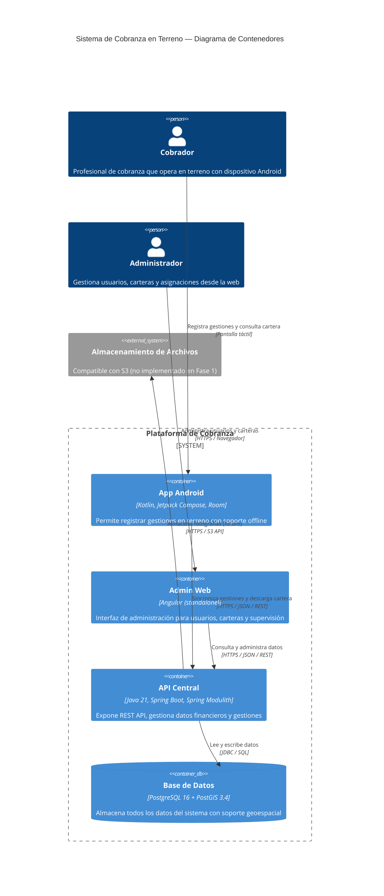
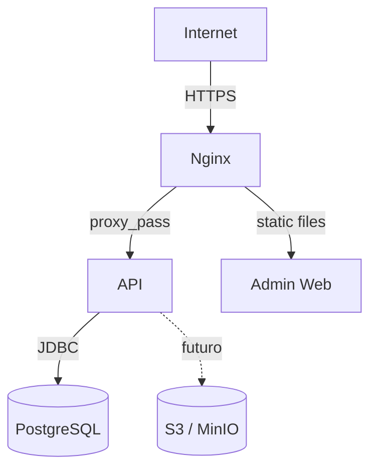

# Diagrama de contenedores

Diagrama C4 de nivel 2 (contenedores) del sistema de cobranza en terreno.

## Notas del diagrama

- **App Android:** opera en modo offline-first. Room actúa como fuente de verdad local para la interfaz. La sincronización con la API ocurre en segundo plano mediante WorkManager.
- **API Central:** monolito modular. No hay microservicios. Un único proceso Spring Boot.
- **Admin Web:** sin soporte offline. Siempre requiere conexión a la API.
- **Almacenamiento de archivos:** el diseño contempla compatibilidad S3 para fotografías, pero no se implementa en la Fase 1.

## Infraestructura de despliegue (futuro)

El despliegue en producción se realizará en un VPS Ubuntu con Docker Compose y Nginx como proxy inverso. Este diagrama es preliminar y se actualizará en la fase de despliegue.
