# Diagrama entidad-relación (preliminar)

Modelo lógico de entidades del sistema de cobranza. Este diagrama representa la estructura conceptual confirmada. No es el esquema físico de Flyway; las tablas definitivas se crearán en la Fase 1B.

## Diagrama principal

```mermaid
erDiagram
    CARTERAS {
        uuid id PK
        varchar nombre
        boolean activa
        timestamptz created_at
        timestamptz updated_at
    }

    PERSONAS {
        uuid id PK
        varchar rut_numero
        varchar rut_dv
        varchar nombre
        timestamptz created_at
        timestamptz updated_at
    }

    CARTERAS_PERSONAS {
        uuid id PK
        uuid cartera_id FK
        uuid persona_id FK
        boolean activa
        date fecha_inicio
        date fecha_fin
        timestamptz fecha_creacion
        timestamptz fecha_actualizacion
        bigint version
    }

    AVALES {
        uuid id PK
        uuid persona_id FK
        varchar rut_numero
        varchar rut_dv
        varchar nombre
        timestamptz created_at
    }

    DIRECCIONES {
        uuid id PK
        uuid persona_id FK
        varchar tipo
        text texto
        boolean vigente
        timestamptz created_at
    }

    OBSERVACIONES_DIRECCION {
        uuid id PK
        uuid persona_id FK
        uuid direccion_id FK
        text observacion
        text direccion_reportada
        uuid usuario_id FK
        uuid dispositivo_id FK
        timestamptz fecha_dispositivo
        timestamptz fecha_servidor
        timestamptz created_at
    }

    OPERACIONES {
        uuid id PK
        uuid persona_id FK
        varchar numero_operacion
        numeric capital
        numeric interes_penal
        numeric gastos_cobranza
        numeric total_vigente
        timestamptz created_at
        timestamptz updated_at
    }

    CUOTAS {
        uuid id PK
        uuid operacion_id FK
        integer numero_cuota
        numeric monto
        date fecha_vencimiento
        varchar estado
        numeric interes_penal
        timestamptz created_at
        timestamptz updated_at
    }

    USUARIOS {
        uuid id PK
        varchar nombre
        varchar username
        varchar email
        varchar password_hash
        varchar rol
        boolean activo
        timestamptz created_at
        timestamptz updated_at
    }

    SUPERVISION_USUARIOS {
        uuid id PK
        uuid supervisor_id FK
        uuid ejecutivo_id FK
        date fecha_inicio
        date fecha_fin
        timestamptz created_at
    }

    DISPOSITIVOS {
        uuid id PK
        uuid usuario_id FK
        varchar identificador_dispositivo
        timestamptz ultima_sincronizacion
        varchar version_app
        integer operaciones_pendientes
        text ultimo_error
        boolean activo
        timestamptz created_at
        timestamptz updated_at
    }

    ASIGNACIONES_MENSUALES {
        uuid id PK
        uuid ejecutivo_id FK
        date fecha_inicio
        date fecha_fin
        varchar fuente
        timestamptz created_at
    }

    ASIGNACIONES_DIARIAS {
        uuid id PK
        uuid asignacion_mensual_id FK
        uuid ejecutivo_id FK
        uuid supervisor_id FK
        date fecha
        varchar estado
        timestamptz fecha_publicacion
        timestamptz created_at
        timestamptz updated_at
    }

    DESCARGAS_ASIGNACION_DIARIA {
        uuid id PK
        uuid asignacion_diaria_id FK
        uuid dispositivo_id FK
        timestamptz fecha_primera_descarga
        timestamptz fecha_ultima_descarga
        varchar version_descargada
    }

    TIPOS_GESTION {
        varchar codigo PK
        varchar descripcion
        boolean activo
    }

    GESTIONES {
        uuid id PK
        varchar origen_gestion
        uuid asignacion_diaria_id FK
        uuid persona_id FK
        uuid ejecutivo_id FK
        varchar tipo_gestion
        timestamptz fecha_gestion
        text observacion
        text observacion_direccion
        double latitud
        double longitud
        real precision_metros
        varchar proveedor_gps
        boolean ubicacion_simulada
        timestamptz fecha_captura_gps
        date fecha_compromiso
        timestamptz fecha_creacion_servidor
    }

    FOTOGRAFIAS_GESTION {
        uuid id PK
        uuid gestion_id FK
        text referencia
        timestamptz fecha_captura
        timestamptz created_at
    }

    OPERACIONES_SINCRONIZACION {
        uuid id PK
        uuid dispositivo_id FK
        uuid gestion_id FK
        varchar estado
        integer intentos
        text ultimo_error
        timestamptz created_at
        timestamptz updated_at
    }

    CARGAS_IMPORTACION {
        uuid id PK
        uuid usuario_id FK
        varchar tipo
        varchar nombre_archivo
        integer filas_totales
        integer filas_aceptadas
        integer filas_rechazadas
        integer filas_advertencia
        varchar estado
        timestamptz created_at
    }

    ERRORES_IMPORTACION {
        uuid id PK
        uuid carga_importacion_id FK
        integer numero_fila
        text descripcion_error
        text fila_original
    }

    CARTERAS ||--o{ CARTERAS_PERSONAS : "aparece en"
    PERSONAS ||--o{ CARTERAS_PERSONAS : "pertenece a"
    PERSONAS ||--o{ AVALES : "tiene"
    PERSONAS ||--o{ DIRECCIONES : "tiene"
    PERSONAS ||--o{ OBSERVACIONES_DIRECCION : "tiene"
    PERSONAS ||--o{ OPERACIONES : "titular de"
    OPERACIONES ||--o{ CUOTAS : "tiene"
    PERSONAS ||--o{ GESTIONES : "gestionada en"
    GESTIONES ||--o{ FOTOGRAFIAS_GESTION : "adjunta"
    GESTIONES }o--o| ASIGNACIONES_DIARIAS : "desde (opcional)"
    USUARIOS ||--o{ SUPERVISION_USUARIOS : "supervisor en"
    USUARIOS ||--o{ SUPERVISION_USUARIOS : "ejecutivo en"
    USUARIOS ||--o{ DISPOSITIVOS : "usa"
    USUARIOS ||--o{ ASIGNACIONES_MENSUALES : "asignado a"
    USUARIOS ||--o{ ASIGNACIONES_DIARIAS : "ejecutivo de"
    USUARIOS ||--o{ ASIGNACIONES_DIARIAS : "supervisor crea"
    ASIGNACIONES_MENSUALES ||--o{ ASIGNACIONES_DIARIAS : "origen de"
    ASIGNACIONES_DIARIAS ||--o{ DESCARGAS_ASIGNACION_DIARIA : "descargada en"
    DISPOSITIVOS ||--o{ DESCARGAS_ASIGNACION_DIARIA : "realiza"
    DISPOSITIVOS ||--o{ OPERACIONES_SINCRONIZACION : "registra"
    GESTIONES ||--|| OPERACIONES_SINCRONIZACION : "seguida por"
    USUARIOS ||--o{ CARGAS_IMPORTACION : "realiza"
    CARGAS_IMPORTACION ||--o{ ERRORES_IMPORTACION : "reporta"
```

## Notas del modelo

- `TIPOS_GESTION` no es una tabla en la implementación actual: `tipo_gestion` es un `VARCHAR(30)` con CHECK constraint. Valores: `CONTACTO_FAMILIAR`, `COMPROMISO_PAGO`, `SIN_CONTACTO`.
- `GESTIONES.origen_gestion`: `ASIGNACION_DIARIA` (requiere `asignacion_diaria_id` no nulo) o `BUSQUEDA_DIRECTA` (sin asignación). Ver ADR-0026.
- `GESTIONES.asignacion_diaria_id`: opcional (NULL para `BUSQUEDA_DIRECTA`).
- `GESTIONES.fecha_compromiso` solo aplica cuando `tipo_gestion = COMPROMISO_PAGO`.
- `GESTIONES.fecha_gestion`: timestamp del dispositivo. `GESTIONES.fecha_creacion_servidor`: generada por el servidor al recibir la gestión. Ver ADR-0029.
- `GESTIONES.id` es el único caso donde el UUID se genera en el dispositivo, no en la base de datos. Ver ADR-0027.
- `GESTIONES` no tiene `updated_at` porque son inmutables. Ver ADR-0028.
- No se almacena `ubicacion GEOMETRY` en gestiones; la posición se representa como `latitud` y `longitud` (`DOUBLE PRECISION`).
- `ASIGNACIONES_DIARIAS_PERSONAS` y `ASIGNACIONES_MENSUALES_PERSONAS` son tablas de relación N:M no mostradas en el diagrama para mantenerlo legible. Ver `MODELO_DATOS.md`.
- El atributo `estado` de `ASIGNACIONES_DIARIAS` acepta: `BORRADOR`, `PUBLICADA`, `FINALIZADA`, `CANCELADA`.
- `OPERACIONES_SINCRONIZACION` representa el outbox de sincronización; puede combinarse con los campos de estado en `GESTIONES` si se prefiere un esquema más compacto.
- Los módulos `REGISTROS_AUDITORIA` y `CURSORES_SINCRONIZACION` se documentarán en la Fase 1B al diseñar el esquema físico.

## PENDIENTE

- Diseñar `REGISTROS_AUDITORIA` (esquema `auditoria`) con las operaciones a registrar.
- Diseñar `CURSORES_SINCRONIZACION` para sincronización incremental (delta por timestamp o secuencia).
- Resolver si `TIPOS_GESTION` es tabla de catálogo en BD o enumerado en el código.
- Confirmar si `COMPROMISOS_PAGO` se extrae como entidad separada o queda como campos en `GESTIONES`.
- Diseñar tablas de relación `ASIGNACIONES_MENSUALES_PERSONAS` y `ASIGNACIONES_DIARIAS_PERSONAS` (actualmente en MODELO_DATOS.md).
